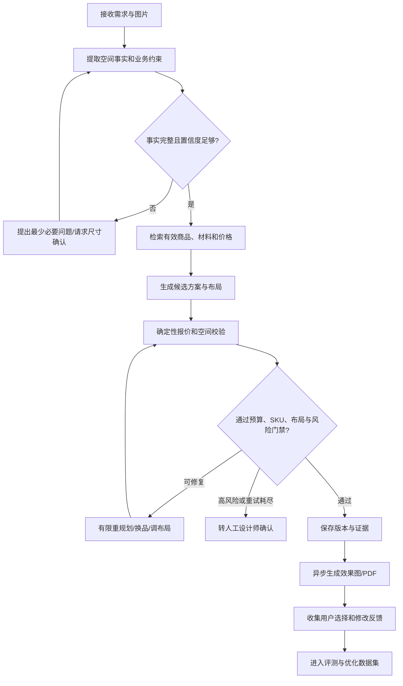

# AI 家装智能体上线开发方案

> 评估日期：2026-08-30
> 目标：把当前可演示、可局部试用的 AI 家装系统，建设为可在单门店或单区域真实使用、可监控、可追责、可持续优化的垂直业务智能体。

## 一、结论先行

项目并不是“离智能体还很远”，而是已经完成了智能体最难替代的一部分业务地基：真实商品库、确定性报价、空间事实模型、布局生成与校验、3D 场景工具、版本留痕和渲染作业。当前主要问题不是缺少更多 Agent 名称，而是现有 Agent 多数仍是固定顺序工作流，缺少生产级闭环、真实经营数据、可靠任务基础设施和运营治理。

当前可定位为：**L2 工作流智能体，局部达到 L3 受控工具智能体**。

建议的近期目标不是追求“完全自主设计师”，而是建设 **L3.5/L4 生产型协作智能体**：

- 能识别信息是否充分，不充分时主动追问；
- 能根据任务状态选择受控工具，而不是固定调用所有节点；
- 能用确定性规则校验商品、价格、空间与安全约束；
- 失败后能够有限重试、换方案、降级或转人工；
- 所有关键决策、模型来源、成本和人工确认均可追踪；
- 不对测量、承重、消防、水电、施工可行性等高风险事项擅自下结论。

在“冻结非核心视觉扩展、优先补真实数据和上线能力”的前提下，按 3–4 人核心团队估算：

| 目标状态 | 当前估算 | 达成周期 | 说明 |
| --- | ---: | ---: | --- |
| 产品演示 | 约 85% | 已具备 | 主链路、3D、方案、报价、渲染、PDF 和订单能力基本齐全 |
| 内部设计师辅助工具 | 约 70% | 2–4 周 | 需要统一流程、真实数据导入和失败提示 |
| 小范围客户封闭试用 | 约 45% | 6–8 周 | 需要可靠队列、真实短信/存储、监控、人工兜底和真实案例评测 |
| 单门店真实运营试点 | 约 30% | 12–16 周 | 需要安全、数据治理、运营后台、SLA、备份恢复和试点迭代 |
| 大规模公开平台 | 低于 20% | 暂不承诺 | 还涉及多租户、供应链、并发、合规、客服和商业运营体系 |

以上百分比不是代码完成度，而是离对应使用场景的综合成熟度。若只有 1 名全职开发者，周期通常需要按 1.8–2.5 倍估算。

## 二、现在已经具备的智能能力

### 2.1 已形成真实业务链路

当前项目已经能串联：

1. 用户填写需求并上传户型图或房间照片；
2. LLM/VLM 完成需求与空间理解；
3. LangGraph 生成多套设计方案；
4. 商品 SKU 从商品库中选择，价格由确定性程序回填；
5. 自动布局生成、评估和修复；
6. 用户通过自然语言修改方案或 3D 场景；
7. 空间工具执行移动、旋转、添加和删除，并进行越界、碰撞及门口净空校验；
8. 生成 Web 3D、Blender 成片、品牌 PDF；
9. 保存不可变版本、客户画像、生成事件和订单意向。

这意味着项目已经超出“聊天机器人 + 效果图”的原型阶段，具备垂直智能体的工具与数据雏形。

### 2.2 已具备的可信机制

- 商品 SKU 与价格不由 LLM 自由编造；
- 报价可以确定性复算并保存快照；
- 场景操作通过白名单工具执行，不执行模型生成代码；
- 布局存在硬约束、评分和有限修复；
- 方案、场景和报价存在版本记录；
- 生成节点、模型、Prompt、用量、成本和耗时已有部分元数据；
- 匿名会话和登录用户具备资源归属隔离；
- 已有跨空间布局评测与较完整的自动化测试基础。

这些能力比“再增加几个会对话的 Agent”更有商业价值，应继续保留确定性边界。

## 三、离真正生产型智能体还差什么

| 维度 | 当前状态 | 上线目标 | 优先级 |
| --- | --- | --- | --- |
| 任务规划 | 主方案生成是固定四节点顺序；场景和精修也是固定三节点 | 能按缺失信息、置信度、预算、布局结果和风险动态分支 | P0 |
| 主动追问 | 已能识别部分缺失字段，但未成为统一 Agent 中断与恢复机制 | 缺关键事实时暂停，提出最少必要问题，用户回答后从检查点继续 | P0 |
| 反思与重规划 | 有校验和部分布局修复，但方案工作流校验失败通常直接失败 | 在最大次数、成本和时限内自动换 SKU、调预算、重布局，再失败转人工 | P0 |
| 长任务可靠性 | 方案生成仍使用 FastAPI `BackgroundTasks`；进程退出不能接管 | 使用独立任务队列与 Worker，支持租约、重试、幂等、取消和死信处理 | P0 |
| 真实经营数据 | 40 件程序化商品模型和模拟规则可演示，但不是完整门店数据 | 导入真实 SKU、有效期价格、库存/交期、材料、工艺、图片/CAD 与来源 | P0 |
| 空间事实可信度 | 有 RoomModel、置信度和尺寸校准 | 低置信事实必须确认；保留原图证据、确认人和变更记录 | P0 |
| 评测真实性 | 规则布局评测成绩高，但主要是构造案例 | 建立脱敏真实案例集，并用人工设计结果与真实用户修改行为评估 | P0 |
| 人工协作 | 有需求确认和尺寸校准，但缺统一审批闸门 | 预算、尺寸、施工风险、公开交付前设置人工确认点 | P1 |
| 记忆 | 已有画像和任务历史，但更多是字段存储 | 区分会话事实、长期偏好、已确认约束和历史决策；提供删除与纠错 | P1 |
| 可观测性 | 有 run/event 和部分成本记录，缺运营面板与告警 | 查看成功率、节点耗时、模型错误、成本、降级率、人工接管率和质量趋势 | P1 |
| 文件与资产 | 主要使用本地目录 | 对象存储、签名访问、生命周期、病毒/内容审核和备份 | P1 |
| 身份与安全 | 有 JWT/RBAC；短信仍为 Mock；部分限流为进程内存 | 真实短信、分布式限流、密钥管理、审计日志、隐私同意与数据保留策略 | P1 |
| 接口收敛 | 正式 PDF/渲染链路与部分旧 Mock 接口并存 | 清理或显式废弃旧入口，确保任何页面都不产生“假成功” | P1 |
| 多租户与规模化 | 当前更接近单实例、单店部署 | 单门店试点后再设计租户隔离、供应商接入和区域扩容 | P2 |

## 四、目标智能体定义

### 4.1 产品角色

目标不是“AI 自动装修”，而是：

> 一个受业务规则约束的 AI 空间设计顾问，帮助客户和设计师完成需求澄清、商品组合、预算控制、空间布局、方案解释与交付材料生成；在事实不足或风险过高时主动请求确认或转人工。

### 4.2 智能体闭环

### 4.3 统一状态模型

下一版建议把分散的工作流状态统一为以下领域状态，避免各 Agent 各自保存一份不一致上下文：

- 身份与任务：`session_id`、`user_id`、`task_id`、`revision_id`；
- 用户目标：空间、风格、预算、家庭结构、生活习惯、优先级；
- 空间事实：房间、尺寸、门窗、固定障碍、置信度、证据与确认状态；
- 业务约束：有效 SKU、价格版本、库存、交期、材料与工艺限制；
- 候选结果：商品候选、方案候选、布局候选、报价快照；
- 校验结果：硬错误、软警告、预算偏差、空间评分、风险等级；
- 执行控制：当前节点、重试预算、总步数、成本上限、超时、取消状态；
- 人工协作：待确认问题、确认人、确认时间、审批结论；
- 交付物：场景版本、渲染作业、PDF、分享链接；
- 可观测信息：模型、Prompt 版本、工具参数、节点耗时、token、成本和错误。

### 4.4 Agent 划分原则

近期采用“一个编排器 + 多个受控能力节点”，不要急于拆成多个自由对话 Agent：

- 需求澄清节点：只负责提取事实、发现缺失和生成追问；
- 空间理解节点：只负责从图片生成带置信度的 RoomModel；
- 商品检索工具：只返回当前有效的 SKU、价格、尺寸、库存与来源；
- 方案规划节点：组合风格、功能和商品候选，不直接决定真实价格；
- 布局工具：生成、评估、修复米制场景；
- 报价工具：确定性计算并生成不可变快照；
- 质量门禁：校验事实、SKU、预算、布局、输出结构和风险；
- 人工确认节点：处理尺寸、预算、施工风险和最终交付审批；
- 交付节点：异步触发渲染、PDF 和分享，不阻塞主方案生成。

只有当各节点需要独立扩缩容、独立权限或独立模型时，再把它们拆成服务或真正的多 Agent。多 Agent 不是智能程度指标，闭环质量才是。

## 五、12–16 周开发路线

### 阶段 0：收敛目标与建立真实基线（第 1–2 周）

目标：确定第一版真实使用边界，避免继续以演示体验代替生产质量。

任务：

1. 冻结新的首页动效、通用页面改版和非核心 3D 精修；
2. 明确首个试点范围，建议只支持客厅、卧室、餐厅和书房，不承诺施工图；
3. 收集并脱敏 50 个真实客户案例，覆盖户型、预算、家庭结构和失败样例；
4. 导入首批真实商品、材料和报价规则，每条数据增加来源、版本、有效期和负责人；
5. 统一标记 Mock、演示数据、真实数据和降级结果；
6. 盘点并收敛重复接口，列出待废弃的旧 Mock/PDF/同步生成入口；
7. 固化上线指标、成本预算和人工接管规则。

验收：

- 真实案例和真实经营数据都有可重复导入方案；
- 能回答“这条价格从哪里来、何时生效、谁修改的”；
- 所有页面都能明确显示真实、模板、演示或失败状态；
- 形成固定的试点范围和不支持事项清单。

### 阶段 1：受控智能体内核（第 2–5 周）

目标：把固定流水线升级为动态、有检查点、可恢复的闭环工作流。

任务：

1. 扩展统一 `DesignAgentState`，纳入事实置信度、缺失字段、重试预算、风险和人工确认；
2. 增加条件边：缺失信息追问、低置信尺寸确认、预算超限重选商品、布局失败重排、重试耗尽转人工；
3. 使用持久化检查点保存节点输入输出，允许用户回答后继续，而不是重新生成全部结果；
4. 建立工具注册表和最小权限：每个节点只能调用批准的查询或写入工具；
5. 设置最大步骤、最大重试、单任务成本和超时，防止循环调用与失控成本；
6. 将方案精修和场景修改接入同一任务上下文与审批记录；
7. 高风险事项只输出“需要专业人员确认”，禁止生成确定性施工结论。

验收：

- 缺少预算或尺寸时不会直接生成伪完整方案；
- 预算超限能在最多 2 次重规划内调整或明确转人工；
- 无效 SKU、错误报价、空间硬冲突不能进入完成状态；
- 用户关闭页面后可从检查点继续；
- 每个任务有明确的步数、重试次数、成本和最终退出原因。

### 阶段 2：可靠异步执行与可观测性（第 4–7 周）

目标：消除单进程后台任务对真实试用的限制。

任务：

1. 将方案生成从 `BackgroundTasks` 迁移到独立队列和 Worker；
2. 复用现有 run/event 表，增加 Worker 租约、心跳、重试、取消、超时和死信状态；
3. 统一方案生成、效果图和 Blender 作业的幂等键与重复提交策略；
4. 建立任务恢复扫描，服务重启后自动接管未完成任务；
5. 建立运营面板：成功率、P50/P95 耗时、节点错误、降级率、token、成本、人工接管率；
6. 建立模型供应商熔断和降级策略，但降级结果必须显式展示；
7. 增加请求关联 ID 和结构化日志，用户报错时可以追到完整链路。

验收：

- Worker 在模型调用中途退出后，任务能自动恢复或明确失败；
- 重复点击不会重复计费或生成多份相同作业；
- 能按任务查看完整执行时间线和成本；
- 模型供应商故障不会造成“假成功”或任务永久卡住。

### 阶段 3：真实业务数据与可落地方案（第 5–9 周）

目标：让“智能”建立在真实门店事实之上。

任务：

1. 商品增加状态、地区、库存、交期、价格有效期、可替代关系和数据来源；
2. 材料与定制报价增加损耗、最低起订、安装、运输、税费和地域差异规则；
3. 建立商品图片、CAD/GLB、材质和授权审核流程；
4. 检索优先使用结构化硬过滤，语义检索只用于风格和偏好排序；
5. 所有报价与方案绑定数据版本，历史结果不受新价格覆盖；
6. 增加缺货、超预算、尺寸不适配时的确定性替代策略；
7. PDF 和分享页只从服务端快照生成，移除或废弃旧 Mock 出口。

验收：

- 线上方案无效 SKU 率为 0；
- 报价可复算一致率为 100%；
- 商品价格、库存或有效期异常时不能静默推荐；
- 随机抽取 20 个方案，设计师能追溯每个商品与价格来源；
- 真实资产失败时显示明确降级，不将程序化模型宣称为数字孪生。

### 阶段 4：真实案例评测与质量飞轮（第 7–11 周）

目标：从“测试通过”升级为“真实客户效果持续变好”。

任务：

1. 将真实案例划分为开发集、回归集和盲测集，禁止用盲测样例调规则；
2. 建立需求理解、空间事实、商品匹配、预算、布局、风格一致性和人工满意度指标；
3. 记录用户采用、删除、替换、移动商品和最终选择，用于定位失败类型；
4. 关键指标按模型版本、Prompt 版本、规则版本和数据版本对比；
5. 每次更换模型、Prompt 或布局规则必须跑离线回归；
6. LLM Judge 仅作为辅助评分，关键事实继续由确定性规则或人工标注判定；
7. 建立失败样例回流流程，优先修复成组问题，不对单个案例打补丁。

首期验收线：

| 指标 | 目标 |
| --- | ---: |
| 关键需求字段准确率 | ≥ 95% |
| 低置信空间事实触发人工确认率 | 100% |
| 有效 SKU 率 | 100% |
| 报价复算一致率 | 100% |
| 真实案例布局硬约束通过率 | ≥ 95% |
| 方案生成任务成功率 | ≥ 95% |
| 严重跨用户访问问题 | 0 |
| 单任务无限循环或无限重试 | 0 |

用户满意度、人工修改率和单任务成本应先测当前基线，再确定业务目标，避免为了好看而凭空设数字。

发布证明约束：模型、Prompt、布局规则、商品数据或评测门禁代码发生敏感变更时，普通 PR 必须校验受保护评测环境针对同一目标提交 SHA 产出的脱敏签名证明。PR runner 不得读取 blind 资产、原始评测证据或签名私钥；缺少对应成功 run、artifact、公开验证密钥、SHA 绑定或签名无效时必须失败关闭。受保护 workflow 必须显式输入目标 SHA，基于该提交运行 development/regression/blind 三组评测，全部通过后才上传只含 proof 的 artifact。proof 不能提交回同一仓库提交。GitHub 分支保护仍需管理员将 `real-world-proof-requirement` 配置为 required check，代码无法替代该外部配置。

### 阶段 5：安全、合规与封闭试点（第 9–16 周）

目标：在真实客户场景中小范围运行，并能安全止损。

任务：

1. 替换 Mock 短信，配置生产密钥管理和分环境配置；
2. 上传文件迁移到对象存储，使用签名访问、生命周期和删除策略；
3. 增加隐私同意、数据用途、保留期限、用户删除和导出能力；
4. 建立审计日志，记录员工查看、修改、导出和角色变更；
5. 使用共享限流、配额、成本上限和异常流量告警；
6. 建立数据库和对象存储备份，实际演练恢复；
7. 完成 HTTPS、生产域名、网关、安全响应头和依赖漏洞处理；
8. 选择 1 个门店、2–5 名设计/销售人员、20–50 名客户进行 2–4 周封闭试点；
9. 每周复盘失败任务、人工接管、客户流失点、平均成本和成交线索；
10. 只有连续两周达到试点验收线后才扩大使用范围。

试点退出标准：

- 不出现商品与报价编造；
- 不出现严重越权或敏感数据泄露；
- 核心任务成功率、恢复能力和人工接管流程达到约定目标；
- 设计师确认系统在部分真实案例上能节省时间，而不是增加返工；
- 单任务模型与渲染成本处于业务可接受范围；
- 完成一次备份恢复和一次模型供应商故障演练。

## 六、下一批两周施工方案

这两周不建议继续扩大页面和 3D 展示范围，直接做下列 P0：

### 任务 1：真实案例与上线指标

- 建立 `backend/evals/cases/real_world/` 数据契约；
- 首批整理 20 个脱敏真实案例，后续扩展到 50 个；
- 每例保存原始输入、人工确认事实、允许商品范围、预算、期望约束和失败标签；
- 新增智能体评测报告模板，记录模型、Prompt、规则与数据版本。

验收：测试集可一条命令运行，失败能够定位到具体事实、商品、预算或布局规则。

### 任务 2：Design Agent 条件路由设计

- 扩展状态模型；
- 增加 `validate_facts`、`request_clarification`、`retrieve_catalog`、`plan_design`、`verify_plan`、`replan_or_escalate` 节点；
- 先使用现有服务作为工具，不重写商品、报价和布局逻辑；
- 为追问、预算重规划、重试耗尽和人工接管先补失败测试。

验收：至少覆盖 4 条路径：直接成功、缺信息暂停、预算超限后成功、重试耗尽转人工。

### 任务 3：可靠队列技术验证

- 选择与现有栈相容的 Redis + Worker 方案；
- 用方案生成做最小迁移验证，复用 `generation_runs/events`；
- 验证进程终止、重复提交、超时、取消和恢复；
- 保留现有接口响应格式，减少前端改动。

验收：杀死 Worker 后任务不会丢失，恢复后不会重复付费。

### 任务 4：演示/Mock/正式链路收敛

- 盘点 `task_service` 模板、上传分析降级、旧 PDF 出口、本地 Mock 数据和 Demo 路由；
- 不立即大删代码，先增加统一来源字段与前端提示；
- 列出废弃计划和迁移期限。

验收：任何一次生成都能清楚区分 `llm`、`template`、`deterministic`、`demo` 和 `human` 来源。

### 任务 5：第一版运营质量页

- 基于现有 `GenerationRun`、`GenerationRunEvent` 和 `LayoutRun` 建立只读统计接口；
- 展示成功率、节点耗时、降级率、成本、布局通过率和失败原因；
- 默认不展示用户原始敏感内容。

验收：能用数据判断一次模型或 Prompt 变更是变好还是变差。

## 七、团队分工建议

最小可执行团队：

- AI/后端 1–2 人：LangGraph、工具层、队列、数据、权限和可观测性；
- 前端/3D 1 人：追问与恢复交互、状态反馈、人工确认和现有 3D 链路维护；
- 产品/家装专家 1 人：真实案例标注、价格规则、风险边界和人工验收；
- 测试/运维 0.5–1 人：回归集、压测、安全、部署和恢复演练。

若没有持续参与的家装业务专家，AI 质量很难靠工程团队单独提升。下一阶段最关键的新增“成员”不是另一个模型，而是能稳定提供真实案例、报价规则和验收判断的业务负责人。

## 八、当前应暂停的方向

在封闭试点完成前，建议暂停或降级以下工作：

- 为首页继续增加大规模视觉动效；
- 为模拟 SKU 追求像素级 3D 外观；
- 同时支持全屋所有空间、施工图和复杂水电改造；
- 将每个步骤包装成独立大模型 Agent；
- 在没有真实评测集时频繁更换模型或 Prompt；
- 在单机后台任务未替换前直接开放公网规模流量；
- 在真实库存、交期和价格数据不足时承诺“可直接下单施工”。

## 九、主要风险与控制方式

### 风险 1：效果好看但无法落地

控制：真实尺寸、SKU、材料、价格与库存是硬约束；效果图只作为视觉参考；施工风险必须人工确认。

### 风险 2：构造评测 100 分，但真实用户大量修改

控制：引入盲测真实案例和用户修改率；规则优化针对问题类别，不针对单例坐标。

### 风险 3：Agent 重试导致成本失控

控制：最大步骤、最大重试、超时、单任务成本上限、模型分级和人工接管。

### 风险 4：模型或 Worker 故障导致任务丢失

控制：持久化队列、租约、幂等、死信、恢复扫描和明确失败状态。

### 风险 5：客户图片和联系方式泄露

控制：最小权限、签名 URL、隐私同意、保留期限、审计、加密、脱敏和删除流程。

### 风险 6：业务数据维护成本被低估

控制：把商品、价格、材料和资产审核做成日常运营流程；明确数据负责人和生效审批，不依赖开发人员手改数据库。

## 十、最终判断

项目已经跨过“AI 概念原型”阶段，但尚未跨过“生产型智能体”阶段。当前最准确的定位是：

> 已有较强确定性工具和业务闭环的 AI 工作流产品，具备升级为垂直智能体的良好基础；短板集中在动态决策、可靠恢复、真实数据、人工协作、评测与运营治理，而不是模型数量或页面数量。

下一阶段的技术主线应固定为：

> **真实数据 → 动态条件工作流 → 确定性校验 → 有限重规划 → 人工接管 → 可靠队列 → 真实案例评测 → 封闭试点。**

完成这条主线后，项目才适合对外表述为“可真实使用的 AI 家装智能体”，并开始验证其是否真正节省设计与销售时间、提高方案转化，而不仅是生成内容。
