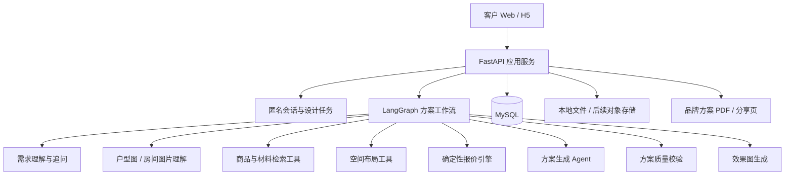

# AI 家装项目 V2 开发路线

## 一、产品目标

第一阶段产品面向客户自行使用，不要求登录。客户可以独立完成：

1. 填写家庭、户型、预算、风格和生活方式需求；
2. 上传户型图或房间照片；
3. 与 AI 设计师补充、确认需求；
4. 获得基于店内商品、材料和报价规则生成的多套方案；
5. 查看效果图、空间布局、商品清单和可解释报价；
6. 调整预算、风格、商品或空间后生成新版本；
7. 下载或分享品牌化方案。

服务端负责维护商品、材料、报价规则、风格模板和生成能力。用户登录、员工销售工作台和正式成交管理放在后续阶段。

## 二、核心原则

- **真实闭环**：每个页面都必须连接真实后端能力，不以占位接口或静默 Mock 作为完成标准。
- **AI 不编造业务数据**：商品 SKU、单价、材料、计价单位和小计由数据库与确定性程序提供。
- **结果可追踪**：明确标记 LLM、规则、模板和人工修改的来源，保留每次生成的版本。
- **功能可降级但不可假成功**：模型不可用时可以使用模板，但界面必须明确告知用户。
- **先可用再扩展**：优先完成客户自助闭环，再建设登录、员工权限、订单和施工管理。
- **数据可替换**：早期使用高质量模拟商品、材料、案例和图片，后续能够无代码替换为真实经营数据。

## 三、目标架构

LangGraph 负责编排、状态、条件分支和失败恢复；商品查询、面积用量、报价计算、SKU 校验等业务规则继续由确定性工具执行。

## 四、阶段规划

### 阶段 A：工程底座与真实状态

目标：建立能够长期演进和安全回滚的工程基础。

- 建立 Git、忽略密钥和运行产物；
- 补齐运行依赖与环境配置说明；
- 引入数据库迁移；
- 建立后端单元测试、API 集成测试和前端关键流程测试；
- 统一错误响应、任务失败状态和日志；
- Mock、模板、真实模型结果在接口和界面中明确区分；
- 上传文件增加类型、大小和内容校验。

验收：

- 新机器按文档可以启动；
- 测试不调用付费模型也能运行；
- 任意生成节点失败后任务有明确失败状态；
- `.env` 和用户上传文件不会进入 Git。

### 阶段 B：客户自助定制闭环

目标：刷新页面后仍能继续同一次设计任务。

- 匿名会话标识；
- 需求草稿、上传图片、聊天历史和当前任务持久化；
- 结构化需求确认页面；
- 方案、报价、效果图和 PDF 统一归属设计任务；
- 历史生成版本与方案重新打开；
- 用户调整需求后创建新版本，而不是覆盖原结果。

验收：

- 无登录用户可以完整生成并重新打开方案；
- 上传、需求、聊天、方案和报价的数据链一致；
- 前端不再依赖模块内存保存 `task_id`；
- 方案详情找不到真实数据时不回退为另一套 Mock 方案。

### 阶段 C：LangGraph Agent V1

目标：把现有顺序调用升级为可观察、可恢复的智能工作流。

- 定义类型化 `DesignAgentState`；
- 需求校验与缺失信息追问；
- 图片上下文整理；
- 商品与材料候选查询；
- 三套差异化方案生成；
- 确定性报价与预算约束；
- SKU、价格、空间和输出结构质量校验；
- 条件重试、模板降级、失败持久化；
- 节点耗时、模型来源和错误记录。

验收：

- 所有商品 SKU 均来自可用商品库；
- 报价可以脱离 LLM 独立复算；
- 预算超限时能够自动调整或给出明确说明；
- 能查询每个工作流节点的执行结果；
- LLM 失败不会产生假成功方案。

### 阶段 D：空间、效果图与 3D

目标：生成结果能够反映客户真实空间。

- 户型图、照片类型识别和质量提示；
- 房间尺寸、门窗和主要约束的人工确认；
- 家具摆位、边界和碰撞检测；
- 基于房间与选中方案生成效果图；
- 生成任务异步化、进度查询、重试和缓存；
- 3D 布局与商品尺寸联动；
- 方案版本与效果图版本绑定。

验收：

- 有参考图时保持主要空间结构；
- 家具尺寸和房间边界不存在明显冲突；
- 效果图失败不影响报价和文本方案查看；
- 同一生成请求不会因重复点击产生多次付费调用。

### 阶段 E：提案、分享与运营后台

目标：形成可展示、可传播、可维护的产品。

- 后端从持久化方案生成 PDF，拒绝客户端篡改报价；
- 无登录分享链接与有效期控制；
- 商品、材料、报价规则、案例和风格模板管理；
- AI 任务、成本、耗时、失败率和模型来源统计；
- 移动端体验、无障碍与加载性能优化；
- 数据备份、部署、监控和恢复说明。

验收：

- 分享页和 PDF 数据与数据库方案一致；
- 后台规则修改只影响新版本，历史报价可追溯；
- 能通过真实案例集进行回归验证；
- 具备小范围客户公开试用条件。

### 阶段 F：后续商业能力

- 用户登录与多端同步；
- 员工账号、角色和销售工作台；
- 客户跟进、预约测量、正式报价和订单；
- 微信小程序；
- 真实商品库存、优惠和供应链集成。

## 五、首批模拟数据

模拟数据需要覆盖真实业务组合，而不是随机字符串：

- 4 个主要空间：客厅、卧室、餐厅、书房；
- 8 种主流风格：现代简约、奶油、原木、北欧、轻法式、侘寂、中古、轻奢；
- 不少于 60 个成品家具 SKU；
- 不少于 30 条材料与定制报价规则；
- 10 个完整客户案例；
- 不同预算、家庭结构、儿童、老人、宠物和收纳需求；
- 每条价格数据标记为“演示参考价”，便于后续批量替换。

生成图片必须标明演示用途，并保留其生成提示词、尺寸、风格和关联商品信息。

## 六、开发与验收方式

- 每次只推进一个可验收的小阶段；
- 修改前阅读真实调用链和数据结构；
- 优先补失败测试，再实现功能；
- 先运行最小相关测试，再运行完整回归；
- 持续追加 `PROJECT_STATUS.md`，记录变更、验证、风险和下一步；
- 阶段完成后提交 Git，保持可回滚；
- 重复且稳定的开发或质量验证流程，可沉淀为项目 Skills。

## 七、当前第一批任务

1. 建立 Git 安全基线；
2. 补齐依赖和本地启动说明；
3. 引入数据库迁移与测试配置；
4. 修复任务失败状态和静默 Mock 假成功；
5. 设计匿名会话与方案版本数据模型；
6. 在不改变现有前端入口的前提下，实现客户自助闭环；
7. 再接入 LangGraph Agent V1。

