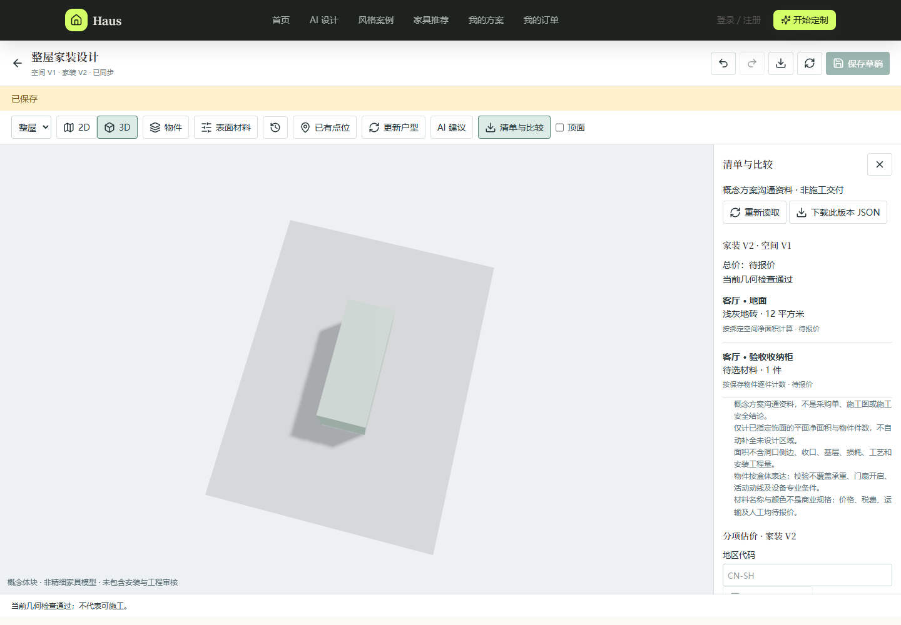

# 豪斯（Haus）AI 家装定制助手

豪斯是一个面向整屋家装设计的 AI 辅助应用。它把户型空间、家装编辑、受控 AI 建议、商品与材料估价、版本比较、冻结交付、审阅和分享放在同一条可追溯工作流中。


## 界面预览

### 家装设计工作台



截图中的户型、物品和价格均为演示数据。

## 当前能力

- **整屋空间**：原图描绘与尺度确认、多房间全局坐标、共享墙、门窗洞口、2D／3D 查看、草稿恢复、撤销重做和不可变版本历史。
- **家装编辑**：家具、设备、灯具、软装、构件及墙／地／顶饰面统一编辑，支持冻结商品与开放几何资产。
- **安装约束**：记录落地、墙装、吊装方式，五向使用预留，以及插座、开关、给排水、网络等已有点位。
- **受控 AI**：模型只生成白名单操作候选，确定性规则负责权限、几何、预算和版本校验，用户确认后才写入新版本。
- **清单与估价**：按精确空间和家装版本生成面积、件数、商品及材料估价；未知或失效规则明确保持“待报价”。
- **交付与协作**：方案比较、不可变冻结交付、打印视图、追加审阅和带到期／撤销能力的受控分享。
- **工程治理**：任务级访问隔离、幂等请求、乐观并发控制、Worker 租约与重试及模型成本账本。

## 技术栈

| 层级 | 主要技术 |
| --- | --- |
| 前端 | React 18、TypeScript、Vite 7、Zustand、Three.js、React Three Fiber、Vitest、Playwright |
| 后端 | Python、FastAPI、Pydantic、SQLAlchemy、LangGraph、Pytest |
| 数据 | MySQL 8、Alembic；测试可使用隔离 SQLite |
| 异步任务 | Generation Worker、Effect Render Worker、Blender Worker |
| 可选生成能力 | OpenAI 兼容文本／视觉模型、Stable Diffusion、ControlNet、Blender |

## 快速开始

### 环境要求

- Windows（仓库提供统一启停脚本）
- Node.js `>=20.19 <25`、npm `>=10`
- Python 3.12（CI 基线）
- MySQL 8
- Blender 与 GPU 依赖仅在使用对应渲染能力时需要

### 安装

在仓库根目录执行：

```powershell
Copy-Item .env.example .env
npm --prefix frontend ci
py -3.12 -m pip install -r backend/requirements-dev.txt
```

首次安装后按 [.env.example](./.env.example) 配置数据库、模型、成本和登录参数。不要提交 `.env`、密钥、数据库备份或用户上传文件。

### Windows 统一启停

```powershell
.\startHaus.bat --check
.\startHaus.bat
.\startHaus.bat --status
```

停止服务：

```powershell
.\stopHaus.bat
```

启动器会管理 API、三个 Worker 和前端进程，日志位于 `backend/.runtime/launcher/`。启动成功后访问：

- 应用入口：<http://127.0.0.1:8080/design/new>
- API：<http://127.0.0.1:8081>
- 就绪检查：<http://127.0.0.1:8081/ready>

启动过程可能执行数据库迁移；已有业务数据时应先按项目流程备份。`--check` 只做环境与 Schema 预检，`/ready` 还会检查数据库、存储和 Worker 心跳，两者都不能替代业务验收。

### 独立启动

前端：

```powershell
npm --prefix frontend run dev
```

后端及 Worker（在 `backend` 目录分别运行）：

```powershell
python -m alembic upgrade head
python -m app.run_api --port 8081
python -m app.workers.generation_worker
python -m app.workers.effect_render_worker
python -m app.workers.blender_worker
```

## 项目结构

```text
backend/       FastAPI、Agent、领域服务、持久化与 Worker
frontend/      React 工作台、2D／3D 编辑器与运营界面
tests/         后端单元／集成测试及浏览器验收脚本
shared/        跨端共享资源
.github/       CI 与发布工作流
outputs/       本地验收产物（大部分不进入版本库）
```

主要入口：

- `frontend/src/pages/DesignStartPage.tsx`：设计入口
- `frontend/src/pages/WholeHomePage.tsx`：整屋空间工作台
- `frontend/src/pages/HomeDesignPage.tsx`：家装设计工作台
- `backend/app/api/routes/`：HTTP API
- `backend/app/agents/`：LangGraph Agent 工作流
- `backend/app/services/`：确定性领域逻辑
- `backend/app/workers/`：异步执行进程

## 核心设计原则

- `DesignTask` 是任务身份，所有私有资源都必须校验任务与会话归属。
- `RoomModel` 保存识别和校准事实；整屋 `spatial/1.0` 使用统一米制全局坐标；单房间 `SceneDocument` 保持独立版本语义。
- 空间、家装、商品、材料规则、报价、渲染和交付都绑定明确版本，不静默覆盖历史结果。
- LLM 负责理解与规划，受控工具执行操作，确定性规则完成权限、几何、价格和发布门禁校验。
- 模型或可信版本缺失时明确失败；正式流程不以模板或 Mock 结果伪装成功。
- 分享凭证、私有缓存和日志遵循最小披露原则；公开响应不暴露内部规则 ID 或敏感令牌。

## 验证

常用检查命令：

```powershell
python -m pytest -q --basetemp=outputs/pytest-local
ruff check backend/app backend/evals tests
npm --prefix frontend run typecheck
npm --prefix frontend test
npm --prefix frontend run build
```

截至 2026-09-20 的最终开发回归基线：

- 后端：`1634 passed, 8 skipped`
- 前端：93 个测试文件，共 `485 passed`
- TypeScript 类型检查与 Vite 7 生产构建通过
- `npm audit`：0 个已知漏洞
- 材料规则真实 MySQL 并发专项通过
- 桌面 1440px 与手机 390px 的代表旅程通过
